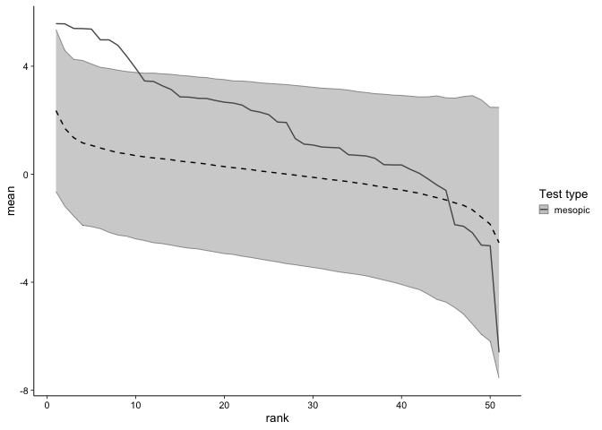

<!-- README.md is generated from README.Rmd. Please edit that file -->

# microperimetr

This package will help you work with microperimetry data.  
It is built for centervue’s maia and compass devices.

## Features

  - Extracting data from MAIA raw (tgz) files becomes as easy as pie.
  - Fully automated comparison of your visual field data with normdata
    from the literature.
  - microperimetr has functions for both location-dependent and
    location-independent visual field analysis. Because the normdata is
    interpolated for location-dependent analysis, any custom grid can be
    used for both types of analysis.
  - microperimetr also includes functions for some more or less common
    visualistaion of visual field data

## Examples

This is a basic example which shows you how to import your visual field
data and plot the (estimated) mean deviation for each included test:

### Load sample visual field data in a breeze

``` r
# save the tgz files from MAIA patient backup into any directory, 
# Here this is "data_raw", a folder in the working directory 
library(microperimetr)
# read the tgz files
testdata <- read_maia(folder = file.path(getwd(), "data-raw"))
#Interpolate normal values for the plot 
compare_dat <- compare(testdata)
```

``` r
field_var <- field_variation(testdat1)
bebie_stats <- calc_bebie(testdat1, field_var)
```

### Get some basic visual field statistics

``` r
# Visual fields statistics arranged nicely in a data frame
mpstats(compare_dat)
#>              mean_sens sd_sens mean_dev  psd
#> 2962_mesopic     23.92    3.61    -1.01 3.02
#> 2963_mesopic     23.94    3.72    -0.97 2.96
#> 2964_cyan        19.06    4.65    -0.96 4.44
#> 2964_red         20.65    4.54    -1.34 3.32
#> 2965_cyan        19.65    4.51    -0.48 4.52
#> 2965_red         19.65    4.51    -2.40 4.33
#> 2993_cyan        14.20    7.57    -4.88 9.41
#> 2994_mesopic     24.21    3.71    -0.39 3.26
#> 2995_mesopic     23.36    3.67    -1.30 3.16
#> 2996_cyan        22.08    4.61     2.42 4.20
#> 2996_red         21.54    3.48    -0.30 2.96
#> 2997_cyan        21.35    4.05     1.49 4.31
#> 2997_red         21.35    4.05    -0.50 4.02
#> 834_mesopic      26.50    4.24     0.16 3.97
#> 835_mesopic      28.46    4.73     2.18 4.52
```

### Plot bebie curves

``` r
plot_bebie(bebie_stats)
```

<!-- -->

### Plot other visual field statistics

``` r
# Plotting mean sensitivity, mean deviation and pattern standard deviation
# Shows the visual field statistics in relation to normal percentiles. 
plot_mpstats(compare_dat)
```

<!-- -->

## Installation

``` r
# for the development version 
devtools::install_github(tjebo/microperimetr)
```

## Sources

Norm data was used from Jonathan Denniss and Maximilian Pfau.

[Raw data from Denniss et al. has been made available
online](https://www.sciencedirect.com/science/article/pii/S2352340916304978).

Accompanying paper in IOVS:
<http://iovs.arvojournals.org/article.aspx?articleid=2571342>
