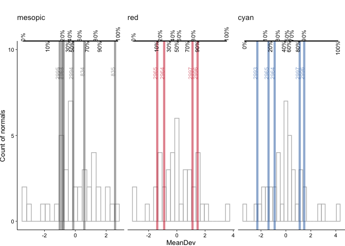

<!-- README.md is generated from README.Rmd. Please edit that file -->

# microperimetr

This package will help you work with microperimetry data.  
It is built for centervue’s maia and compass devices.

## Features

  - Extracting data from MAIA raw (tgz) files becomes as easy as pie.
  - Fully automated comparison of your visual field data with normdata
    from the literature.
  - microperimetr has functions for both location-dependent and
    location-independent visual field analysis. Because the normdata is
    interpolated for location-dependent analysis, any custom grid can be
    used for both types of analysis.
  - microperimetr also includes functions for some more or less common
    visualistaion of visual field data

## Example

This is a basic example which shows you how to import your visual field
data and plot the (estimated) mean deviation for each included
test:

``` r
# save the tgz files from MAIA patient backup into any directory, here "norm_raw", which is a folder in the working directory 
library(microperimetr)
library(tidyverse)
testdata <- read_maia(folder = file.path(getwd(), "data-raw"))
```

``` r
# Get some basic visual field statistics
mpstats(testdata)
#> [using ordinary kriging]
#> [using ordinary kriging]
#> [using ordinary kriging]
#> [using ordinary kriging]
#> [using ordinary kriging]
#> [using ordinary kriging]
#> [using ordinary kriging]
#> [using ordinary kriging]
#> [using ordinary kriging]
#> [using ordinary kriging]
#> [using ordinary kriging]
#> [using ordinary kriging]
#> [using ordinary kriging]
#> [using ordinary kriging]
#> [using ordinary kriging]
#> [using ordinary kriging]
#> [using ordinary kriging]
#> [using ordinary kriging]
#> [using ordinary kriging]
#> [using ordinary kriging]
#> [using ordinary kriging]
#> [using ordinary kriging]
#> [using ordinary kriging]
#> [using ordinary kriging]
#> [using ordinary kriging]
#> [using ordinary kriging]
#> [using ordinary kriging]
#> [using ordinary kriging]
#> [using ordinary kriging]
#> [using ordinary kriging]
#>              mean_sens sd_sens mean_dev  psd
#> 2962_mesopic     23.92    3.61    -1.05 2.92
#> 2963_mesopic     23.94    3.72    -0.96 2.82
#> 2964_cyan        19.06    4.65    -0.87 4.58
#> 2964_red         20.65    4.54    -1.21 3.30
#> 2965_cyan        19.65    4.51    -0.26 4.49
#> 2965_red         19.65    4.51    -2.27 4.28
#> 2993_cyan        14.20    7.57    -4.21 9.48
#> 2994_mesopic     24.21    3.71    -0.35 3.18
#> 2995_mesopic     23.36    3.67    -1.22 3.04
#> 2996_cyan        22.08    4.61     2.76 4.23
#> 2996_red         21.54    3.48    -0.16 3.13
#> 2997_cyan        21.35    4.05     1.86 4.34
#> 2997_red         21.35    4.05    -0.37 4.04
#> 834_mesopic      26.50    4.24     0.27 3.75
#> 835_mesopic      28.46    4.73     2.20 4.47
# Plot mean sensitivity, mean deviation and pattern standard deviation 
plot_mpstats(testdata)
#> [using ordinary kriging]
#> [using ordinary kriging]
#> [using ordinary kriging]
#> [using ordinary kriging]
#> [using ordinary kriging]
#> [using ordinary kriging]
#> [using ordinary kriging]
#> [using ordinary kriging]
#> [using ordinary kriging]
#> [using ordinary kriging]
#> [using ordinary kriging]
#> [using ordinary kriging]
#> [using ordinary kriging]
#> [using ordinary kriging]
#> [using ordinary kriging]
#> [using ordinary kriging]
#> [using ordinary kriging]
#> [using ordinary kriging]
#> [using ordinary kriging]
#> [using ordinary kriging]
#> [using ordinary kriging]
#> [using ordinary kriging]
#> [using ordinary kriging]
#> [using ordinary kriging]
#> [using ordinary kriging]
#> [using ordinary kriging]
#> [using ordinary kriging]
#> [using ordinary kriging]
#> [using ordinary kriging]
#> [using ordinary kriging]
```

<!-- -->

## Installation

``` r
# for the development version 
devtools::install_github(tjebo/microperimetr)
```

## Sources

Norm data was used from Jonathan Denniss and Maximilian Pfau.

[Raw data from Denniss et al. has been made available
online](https://www.sciencedirect.com/science/article/pii/S2352340916304978).

Accompanying paper in IOVS:
<http://iovs.arvojournals.org/article.aspx?articleid=2571342>
